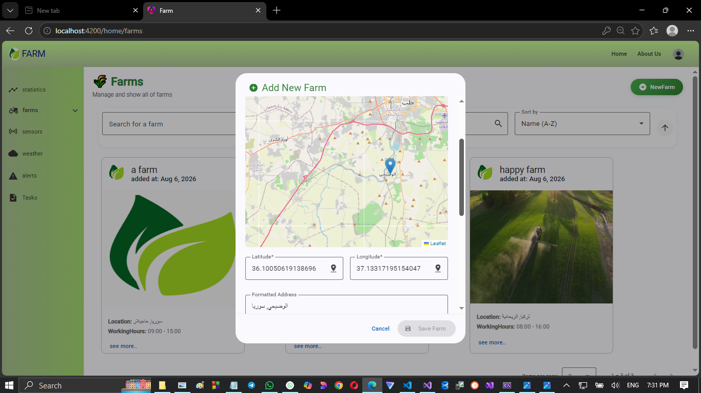
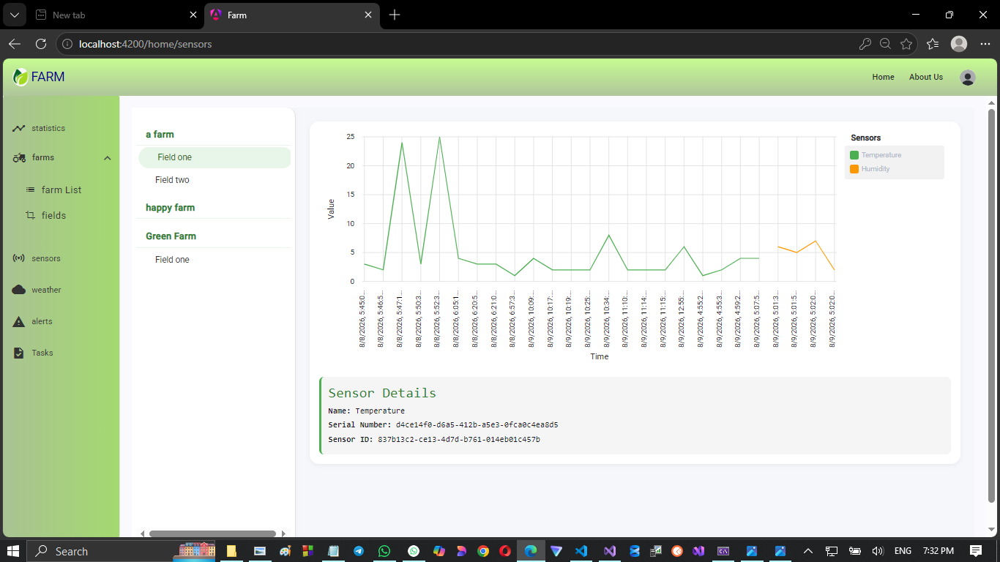

# 🌾 Smart IoT Agricultural & Land Management Platform

A high-performance, full-stack precision farming platform designed for real-time land management, geospatial crop tracking, and live environmental telemetry streaming. Built using **ASP.NET Core Web API (.NET 8)** following **Clean Architecture** and paired with an interactive **Angular** frontend.

---

## 📌 Executive Summary & Value Proposition

Traditional agriculture often relies on reactive decision-making. This platform shifts the paradigm to **data-driven precision farming** by aggregating real-time IoT sensor telemetry, geospatial location mapping, and third-party environmental APIs into a unified dashboard. 

### **Business & Operational Impact:**
- 📉 **Crop Damage Mitigation:** Instant threshold-based notifications allow early intervention before fungal diseases or soil degradation occur.
- 🗺️ **Centralized Asset & Spatial Tracking:** Manage vast multi-field boundaries, neighbor proximities, and assigned equipment from a single interactive map.
- 📊 **Resource Optimization:** Real-time metrics lay the operational foundation for future smart automated irrigation and automated fertigation systems.

---

## 📸 Project Showcase

*(Tip: Add your actual screenshots/GIFs in a `screenshots/` folder)*

| Real-Time IoT Telemetry Dashboard | Geospatial Land Map (Leaflet) |
|-----------------------------------|-------------------------------|
|  |  |

| Analytics & Sensor Trends (`ngx-charts`) | Admin Control Center |
|------------------------------------------|----------------------|
|  |  |

---

## ✨ Key Features

### ⚡ **Real-Time IoT Telemetry Streaming**
- Live monitoring of environmental metrics (**Temperature, Humidity, Soil Salinity, etc.**) distributed across farm fields.
- Powered by **SignalR WebSockets** for push-based, real-time data streaming to the frontend with zero page refreshes.

### 🗺️ **Geospatial & Neighbor Proximity Mapping**
- Integrated **Leaflet Maps** for pinpointing farm coordinates and defining field boundaries.
- Backend **Spatial Distance Calculation Service** to compute proximity between fields and neighboring registered farms.

### 🔌 **Third-Party API Integrations**
- **Open-Meteo API:** Dynamic local weather forecasts and atmospheric data.
- **LandGIS API:** Automated soil metrics retrieval based on exact geographic coordinates.
- **Cloudinary Integration:** Cloud-based image upload and media management for farm profiles and reports.

### 📊 **Analytics & Lazy-Loaded Admin Hub**
- Interactive data visualizations using **`ngx-charts`** to track sensor trends over time.
- Fully isolated **Admin Dashboard** utilizing Angular **Lazy Loading** to optimize initial application bundle size and load speed.

### 🛡️ **Security, Logging & Performance**
- **JWT Authentication** with granular **Role-Based Access Control (RBAC)**.
- **Serilog Structured Logging** configured to sync logs simultaneously to both Console and File sinks.
- **Mapster** integration for lightning-fast object mapping.
- **Generic Repository Pattern** supporting server-side searching, filtering, and optimized pagination.

---

## 🗺️ Product Roadmap & Future Expansion

The current release (**MVP**) establishes a robust data ingestion layer. Thanks to its modular design, the platform is architected to support future domain scaling:

- 🚜 **Agricultural Land Marketplace (Buy, Sell & Rent):** A dedicated real estate module enabling landowners and investors to list, purchase, or lease agricultural land with verified geospatial boundaries and soil metrics.
- 🚰 **Automated Smart Irrigation:** Triggering physical relay valves based on live soil moisture thresholds.
- 🤖 **Predictive AI Disease Forecasting:** Machine Learning models analyzing historical telemetry logs to predict pest outbreaks.
- 📱 **Mobile Native Companion:** Cross-platform mobile app for field workers with offline telemetry caching.

---

## 🛠️ Tech Stack & Architecture

### **Backend (.NET 9 Web API)**
- **Architecture:** Clean Architecture (Domain, Application, Infrastructure, API)
- **Data & Persistence:** Entity Framework Core, SQL Server
- **Design Patterns:** Repository Pattern, Spatial Distance Calculation Service, Mapster
- **Real-Time & Security:** SignalR Hubs, JWT Bearer Authentication (RBAC)
- **Logging & Tools:** Serilog (Console & File Sinks), Cloudinary SDK

### **Frontend (Angular)**
- **UI Framework:** Angular Material, SCSS
- **Mapping & Charts:** Leaflet.js, `ngx-charts`
- **Asynchronous & State Management:** RxJS, SignalR Client, Lazy Loading Routing

```text
[ IoT Sensors / Simulated Data Stream ]
                  │
                  ▼
      [ ASP.NET Core Web API ]
  (Clean Architecture + Repository) ──(EF Core)──► [ SQL Server ]
     ├── Open-Meteo & LandGIS APIs
     ├── Spatial Distance Calculation
     └── Cloudinary Storage
                  │
             (SignalR Hub)
                  │
                  ▼
        [ Angular Frontend ]
   (Lazy-Loaded Modules + Leaflet) ──► Real-Time Dashboard & Analytics
```
## 🚀 Getting Started
Prerequisites
.NET 9.0 SDK

Node.js (v18+ recommended) & npm

SQL Server

## Backend Setup
1. Navigate to the backend directory:

```Bash
cd Backend/FarmApi
```
2. Configure your connection string in appsettings.json and add your Cloudinary, JWT, and API keys.

3. Apply database migrations:

```Bash
dotnet ef database update
```
4. Run the API service:

```Bash
dotnet run
```
## Frontend Setup
1. Navigate to the frontend directory:

```Bash
cd Frontend/FarmUI
```
2. Install dependencies:

```Bash
npm install
```
3. Launch the development server:

```Bash
ng serve --open
```
## 👤 Author
**Mohammad Almostafa**

*Information Engineer | Full-Stack (.NET & Angular) Developer*

- 🌐 **LinkedIn:** https://www.linkedin.com/in/mohammad-almostafa-9ba822289/

- 🐙 **GitHub:** https://github.com/Mohammad-Almostafa

- 📧 **Email:** m.m.almostafa02@gmail.com
